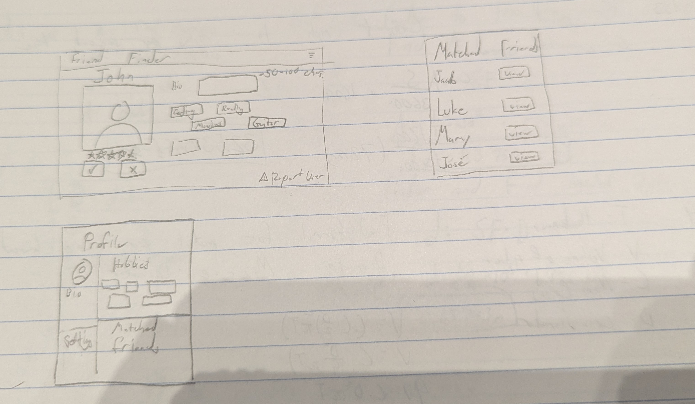

# Friend Finder

[My Notes](notes.md)

 - Users sign in with email and password, optionally providing a phone number.
 - The app is designed around college-aged young adults.
 - Upon sign up users select a number of hobbies or interests that can be edited latter.
 - Users can then find friends that share a number of hobbies with them and decide whether or not they would like to reach out to them.

For this deliverable I did the following. I checked the box `[x]` and added a description for things I completed.

- [x] Proper use of Markdownk
- [x] A concise and compelling elevator pitch
- [x] Description of key features
- [x] Description of how you will use each technology
- [x] One or more rough sketches of your application. Images must be embedded in this file using Markdown image references.

### Elevator pitch

To combat the rising epidemic of loneliness among the younger generation, Friend Finder acts as a dating app, except for friends! A user inputs hobbies they have and activities they enjoy, and Friend Finder will match them with people with similar interests. If the users decide they would like to meet, they can provide contact information into the app to reach out to each other. With this app, those that may have trouble finding friends will have a much easier time.

### Design

It will be designed in a way that makes it easy to see as much information as was provided by the user. Having the ability to view ratings and the interests of users creates a way to find who matches your interests while allowing the community to self-regulate in decreasing the rating of users that are unkind or have malintent.

### Key features

- Hobby/Interest Match Making
- Reach Out Button/Functionality
- Profile Photo
- Database saving user information
- Menu of matched friends and give ratings.

### Technologies

I am going to use the required technologies in the following ways.

- **HTML** - Build the framework of the website, making the basic scaffolding of the website.
- **CSS** - Format the website and make it look much nicer.
- **React** - Allow for users to interact with the website with buttons to either accept or decline recommended friends.
- **Service** - Pull from database to match users that share similar interests.
- **DB/Login** - Login using email and password, store authentication credentials and user data.
- **WebSocket** - Update matched friends and ratings, chat feature.

## 🚀 AWS deliverable

For this deliverable I did the following. I checked the box `[x]` and added a description for things I completed.

- [x] **Server deployed and accessible with custom domain name** - https://friendfinder.click.

## 🚀 HTML deliverable

For this deliverable I did the following. I checked the box `[x]` and added a description for things I completed.

- [x] **HTML pages** - I have 5 total htmls pages
- [x] **Proper HTML element usage** - I followed proper guides on how to format html code correctly.
- [x] **Links** - I have links
- [x] **Text** - I have text placeholders for where I will have text on the full page, and some other text where appropriate.
- [x] **3rd party API placeholder** - Place holder for the location services is there.
- [x] **Images** - Placeholder image located on the home and account pages.
- [x] **Login placeholder** - I have a placeholder screen set up
- [x] **DB data placeholder** - Placeholders are implemented for the saved data like hobbies.
- [x] **WebSocket placeholder** - I have a button so you can chat with other friends that are online.

## 🚀 CSS deliverable

For this deliverable I did the following. I checked the box `[x]` and added a description for things I completed.

- [x] **Visually appealing colors and layout. No overflowing elements.** - I have a color scheme that I'm happy with to make a cozy appealing view
- [x] **Use of a CSS framework** - I used Bootstrap
- [x] **All visual elements styled using CSS** - Everything is styled with CSS
- [x] **Responsive to window resizing using flexbox and/or grid display** - I used flex styling to help make the window responsive to resizing.
- [x] **Use of a imported font** - Imported a font from Google.
- [x] **Use of different types of selectors including element, class, ID, and pseudo selectors** - I used element, class, and id selectors.

## 🚀 React part 1: Routing deliverable

- [x] **Bundled using Vite** - I used vite to help make all my pages into one page to make the site smoother
- [x] **Components** - I made each html file instead into a .jsx file that can be used as components switched in and out from my main html page.
- [x] **Router** - I implemented a router that directs between the different webpages of mine.

## 🚀 React part 2: Reactivity deliverable

- [x] **All functionality implemented or mocked out** - I implemented the ability to store data in local storage and mocked out the ability to chat with other users. Also have mocked out images for the site
- [x] **Hooks** - I used useState and useEffect hooks. useEffect for when I needed things to be triggered by other things, and I used useState to basically initialize and edit variables.

## 🚀 Service deliverable

- [x] **Node.js/Express HTTP service** - Updated to use a back end with Node.js
- [x] **Static middleware for frontend** - In index.js I use the app.use() function to serve my static frontend files
- [x] **Calls to third party endpoints** - I made a call to dummyjson to get random inspirational quotes on the account page. I attempted to use programming quotes, but could not find a working API that allowed CORS and this assignment is due very shortly, so I am out of time.
- [x] **Backend service endpoints** - Created endpoints for authentication, user profiles, and matches/removing friends.
- [x] **Frontend calls service endpoints** - Updated all my files to call the backend instead of using localStorage for everything.
- [x] **Supports registration, login, logout, and restricted endpoint** - You can create and save users with encrypted and checked passwords.

## 🚀 DB deliverable

I added a database for persistent data storage. It was surprisingly easy and simple to do with MongoDB.

- [x] **Stores data in MongoDB** - I now store my data in MongoDB instead of locally.
- [x] **Stores credentials in MongoDB** - I encrypted my credentials with bcrypt before storing them in my data base.

## 🚀 WebSocket deliverable

I implemented WebSocket allowing for users to interact with each other. Currently the chat messages disappear upon closing the chat. I have not decided if I want disappearing messages or to make them persistent, so I am going to leave them disappearing as a security/privacy measure for now.

- [x] **Backend listens for WebSocket connection** - Added WebSocket server to index.js.
- [x] **Frontend makes WebSocket connection** - Both my home and friends page connect to my new WebSocket connection.
- [x] **Data sent over WebSocket connection** - I send message and notification data via WebSocket.
- [x] **WebSocket data displayed** - They are displayed in the form of a chat log.
- [x] **Application is fully functional** - I have everything I wanted to implement completed and working.
